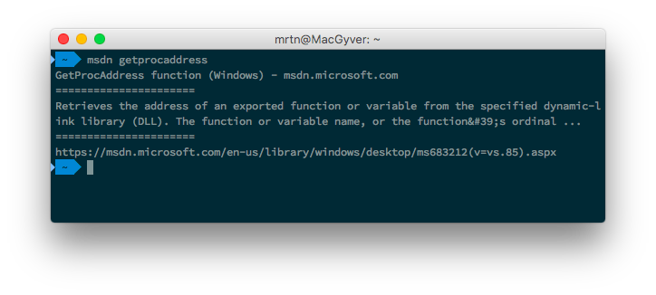

# MSDN quick function lookup

Since I've been doing a lot of lookups for basic functions at MSDN, I wanted to create a tool for faster and simpler lookup. Most of the times, I just need the basic, one-line description of what the function does.

## Alias
add the following to your .zshrc (or bash config):
> alias msdn="python PATH/TO/FOLDER/msdn.py"
